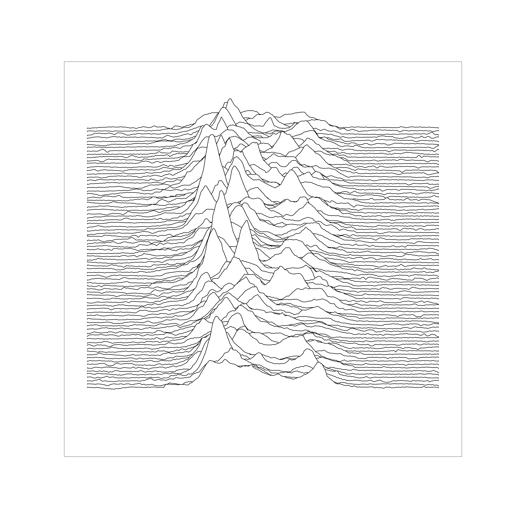

# Joy Division _Unknown Pleasures_ Plot

Recreating Joy Division's [iconic album artwork](https://en.wikipedia.org/wiki/Unknown_Pleasures) in Python, using Matplotlib, Pandas, and the [pulsar.csv](https://gist.github.com/borgar/31c1e476b8e92a11d7e9) dataset.

The original artwork was created using electromagnetic radio waves from pulsar PSR B1919+21, discovered by Jocelyn Bell Burnell in 1967.

Here's my rendering:

Many thanks to these sources:
- Borgar: https://gist.github.com/borgar/31c1e476b8e92a11d7e9
- Mike Bostock: https://observablehq.com/@mbostock/psr-b1919-21
- R on datawookie: https://www.r-bloggers.com/2019/07/recreating-unknown-pleasures-graphic/
- Igor Oliveira: https://github.com/igorol/unknown_pleasures_plot 
